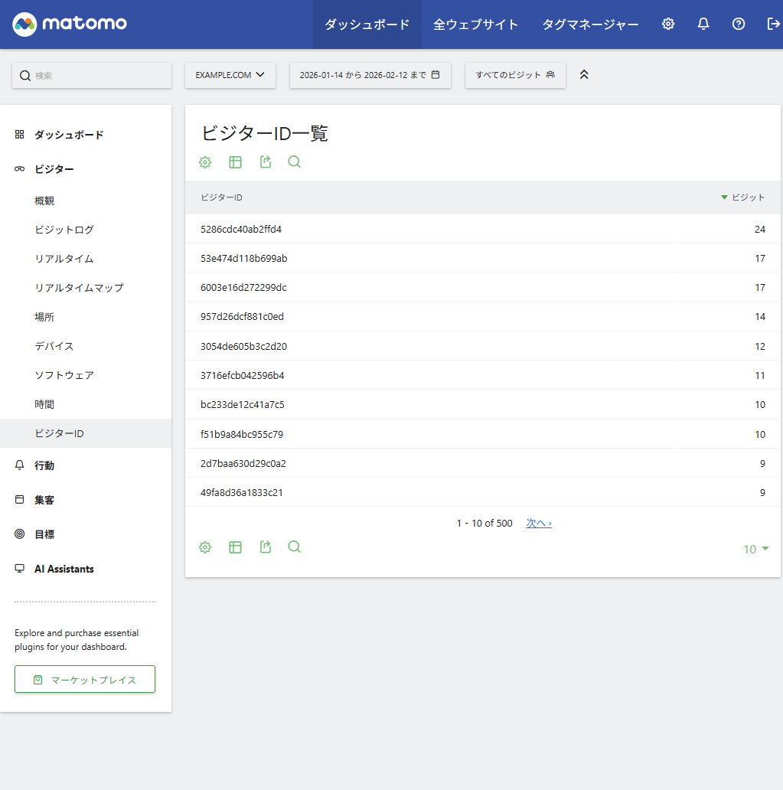
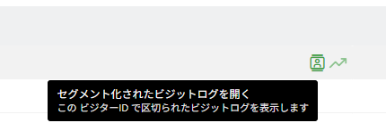

# VisitorIdReport - Matomo Plugin

Matomoで常連さんの動向を眺めるためのプラグインです。LLMにガッと作らせたので色々雑です。

具体的にはMatomoのビジターIDごとの訪問数を一覧表示するプラグインです。

## スクリーンショット

### プラグイン画面



ビジターカテゴリのビジターIDに追加されます。

### 行ボタン



セグメント化ボタンを押すことで当該IDのビジットログが見れます。

推移グラフは未実装です。

## 機能

- **ビジターID一覧** — 訪問数の多い順にソートされたテーブルを表示
  - 最大500件
- **セグメント化されたビジットログ** — 各行のアイコンからそのビジターのログを直接閲覧

## 動作確認環境

- Matomo 5.7.1
  - 5.0.0以上をインストール要件にしてますが動作確認してないです
- PHP 8.3.8
  - 確認してませんが、7以降なら動くと思います

## インストール方法

1. このリポジトリをダウンロードする
2. VisitorIdReportディレクトリをzipにする
3. Matomoの管理者画面を開き、プラグインをアップロードし有効化する

## 使い方

有効化後、サイドバーの **訪問者 → ビジター ID** からアクセスできます。

## 既知の不具合

- 推移グラフが未実装
  - 推移グラフのボタンを押すとエラーになります

## ファイル構成

```
VisitorIdReport/
├── plugin.json                  # プラグインメタ情報
├── VisitorIdReport.php          # プラグインエントリーポイント
├── API.php                      # API メソッド（データ取得・整形）
├── Columns/
│   └── VisitorId.php            # Dimension 定義（Row Evolution 用）
├── Reports/
│   └── GetVisitorIdList.php     # レポート定義（UI 設定）
├── lang/
│   ├── en.json                  # 英語翻訳
│   └── ja.json                  # 日本語翻訳
└── README.md
```

## API

### `VisitorIdReport.getVisitorIdList`

指定期間のビジター ID と訪問数の一覧を返します。

**パラメーター:**

| パラメーター | 必須 | 説明                                         |
| ------------ | ---- | -------------------------------------------- |
| `idSite`     | ✅   | サイト ID                                    |
| `period`     | ✅   | `day`, `week`, `month`, `year`, `range`      |
| `date`       | ✅   | 日付（例: `today`, `2026-01-01,2026-01-31`） |

**リクエスト例:**

```bash
MATOMO_BASE='https://example.com'
TOKEN='xxxxxxxxxxxxxxxxxxxxxxxx'
curl ${MATOMO_BASE}'/?module=API&method=VisitorIdReport.getVisitorIdList&idSite=1&date=last30&period=range&format=JSON' \
  -d 'token_auth='${TOKEN}
```

**レスポンス例:**

```json
[
  {
    "label": "a1b2c3d4e5f6a7b8",
    "nb_visits": 42,
    "segment": "visitorId==a1b2c3d4e5f6a7b8"
  },
  {
    "label": "1234567890abcdef",
    "nb_visits": 17,
    "segment": "visitorId==1234567890abcdef"
  }
]
```

## ライセンス

MIT
